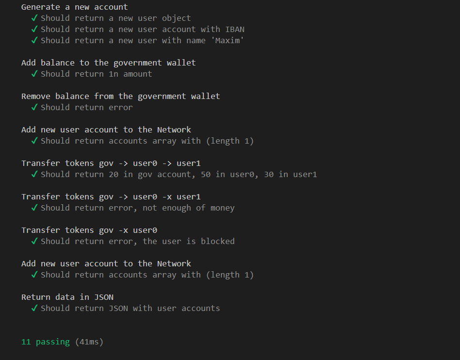

### task Payment System

Эмуляция работы простейшей платежной системы. Пользователи и центр эмиссии
разделены, все сущности системы представлены в виде независимых модулей.

* установите nodejs v18+ https://nodejs.org/en
* установите git https://git-scm.com/downloads
* последовательно введите команды в терминале
```
git clone https://github.com/GemsGame/task-payment-system.git
cd task-payment-system
npm install
npm run build
npm run test
```

Система должна пройти все тесты, которые включают:
* Cоздание аккаунтов пользователя с IBAN
* Эмиссию денег на аккаунт
* Изьятие денег
* Добавление нового аккаунта пользователя в сеть
* Вывод данных в JSON
* Попытку потратить деньги, когда баланса недостаточно
* Трансфер денег между пользователями
* Отклоненный трансфер, если пользователь заблокирован

>Техническое описание системы доступно в docs/index.html


